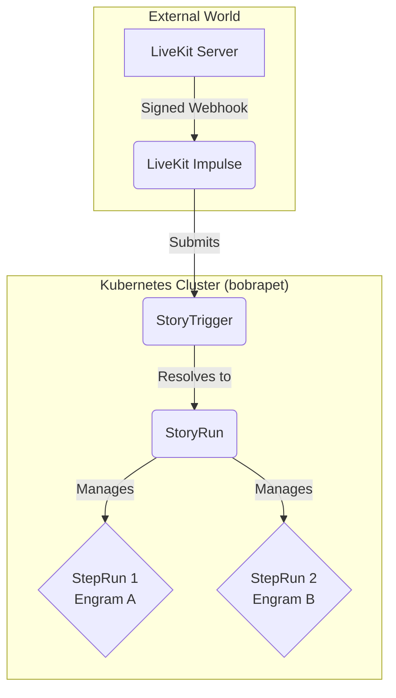

# 🎙️ LiveKit Webhook Impulse

[](https://livekit.io/)

A stateless, production-ready **Impulse** for the [bobrapet](https://github.com/bubustack/bobrapet) workflow engine that acts as a secure bridge between your [LiveKit](https://livekit.io/) projects and your automated workflows.

This impulse listens for signed webhook events from a LiveKit server, validates their authenticity, and submits durable `StoryTrigger` requests in your bobrapet cluster. The controller then resolves those requests into `StoryRun`s. It is designed to be a simple, robust, and highly scalable entry point for any workflow that needs to react to real-time events in your LiveKit rooms.

---

## 🌟 Highlights

- Verifies signed LiveKit webhooks before any workflow trigger is submitted.
- Filters events, participants, and rooms before creating durable `StoryTrigger` requests.
- Supports policy-based routing so the same impulse can start different realtime stories.
- Stays stateless and easy to scale behind a normal Kubernetes Service/Ingress.

## 🏗️ Architecture

As an **Impulse**, this component's role is to act as a *trigger*. It is the "when" of your system, connecting an external event source (LiveKit) to the "what" (a Story).



The impulse is intentionally minimal and stateless, focusing on three core responsibilities:

1.  **Webhook Verification**: Ensures incoming webhooks are authentic using JWT signature verification.
2.  **Event Filtering**: Filters events based on a configurable allowlist and ignores events from self-identified agents to prevent infinite loops.
3.  **Story Triggering**: Uses the Bubu SDK to submit the target `StoryTrigger`, passing a clean, structured representation of the LiveKit event as inputs. The controller then creates or reuses the target `StoryRun`.

All complex routing logic (e.g., "run Story A for `participant_joined` and Story B for `room_finished`") should be handled by a dedicated **Router Story** triggered by this impulse. This keeps the impulse lean and allows you to evolve your routing logic without redeploying this component.

---

## 🚀 Quick Start

1. Create a Kubernetes secret containing your LiveKit API key and secret:
   ```yaml
   apiVersion: v1
   kind: Secret
   metadata:
     name: my-livekit-keys
   stringData:
     API_KEY: "LK..."
     API_SECRET: "..."
   ```
2. Apply the `Impulse.yaml` template and create an `Impulse` resource that points at your target Story.
3. Expose the Service on port `8080` with a Kubernetes `Service`/`Ingress`.
4. Register the same webhook URL and credentials in your LiveKit project.

## ⚙️ Configuration (`Impulse.spec.with`)

The impulse is configured via its `Impulse.yaml` template.

The target Story is specified via the standard `Impulse.spec.storyRef` field.

| Parameter                | Type       | Description                                                              | Default                                  |
| ------------------------ | ---------- | ------------------------------------------------------------------------ | ---------------------------------------- |
| `storyRef.name`          | `string`   | Target Story to trigger (required by Impulse CRD).                       | **Required**                             |
| `storyRef.namespace`     | `string`   | Namespace of the target Story (optional, defaults to same namespace).    | -                                        |
| `with.eventsAllowlist`   | `[]string` | List of LiveKit event names to accept (supports `*` and `foo*`).          | `["participant_joined", "room_started"]` |
| `with.selfIdentities`    | `[]string` | Participant identities to ignore (e.g., your bot/agent identities).      | `["bubu-agent"]`                         |
| `with.path`              | `string`   | The HTTP URL path for the webhook listener.                              | `/webhook`                               |
| `with.policies`          | `[]Policy` | Optional routing policies (match on event/room/participant + override story & inputs). | `[]`                                      |
| `secrets.livekitWebhook` | `secret`   | A Kubernetes secret containing `API_KEY` and `API_SECRET` for JWT validation. | **Required**                             |

Each entry in `with.policies` can specify:

- `name` / `description`: free-form identifiers for observability.
- `storyName`: override the target story for matching events (defaults to `storyRef` if omitted).
- `events`, `rooms`, `participants`: matchers that accept exact strings, `*`, or `prefix*`.
- `storyInputs`: static JSON passed through to the Story as `policy.inputs` and `policyInputs`.
- `metadata`: lightweight labels/annotations surfaced inside the Story for downstream routing.

## 🔐 Secrets

Map `secrets.livekitWebhook` to a Kubernetes secret containing:

```yaml
stringData:
  API_KEY: "LK..."
  API_SECRET: "..."
```

## 🌐 Environment Variables

This impulse has **no** required environment variables. All configuration is handled via the `Impulse` resource's `with` block and `secrets` mapping for maximum clarity and security.

---

## 📥 Story Inputs

When this impulse resolves a Story trigger, it provides a structured JSON object as the resulting `StoryRun`'s inputs.

```json
{
  "event": {
    "type": "participant_joined",
    "id": "EV_Abc123",
    "createdAt": 1678886400,
    "raw": {
      "participant": {
        "identity": "user-alice"
      }
    }
  },
  "room": {
    "name": "my-awesome-room",
    "sid": "RM_Xyz789"
  },
  "participant": {
    "identity": "user-alice",
    "sid": "PA_Def456"
  },
  "policy": {
    "name": "voice-on-join",
    "inputs": {
      "entryEngram": "livekit-agent",
      "transport": "voice"
    },
    "metadata": {
      "tier": "vip"
    }
  },
  "policyInputs": {
    "entryEngram": "livekit-agent",
    "transport": "voice"
  }
}
```

---

## 🔄 Runtime Notes

Create an `Impulse` resource using the template. Point it to your secret and declare the policies that should spawn Stories (for example, kick off a realtime voice or translation Story when someone joins a room).

```yaml
apiVersion: bubustack.io/v1alpha1
kind: Impulse
metadata:
  name: my-livekit-trigger-for-my-app
spec:
  templateRef:
    name: livekit-webhook
  # Target story is specified via storyRef (required by Impulse CRD)
  storyRef:
    name: livekit-router
  with:
    eventsAllowlist:
      - "participant_joined"
      - "room_started"
    policies:
      - name: voice-on-join
        description: "Start the real-time voice assistant when VIP users join"
        events:
          - participant_joined
        rooms:
          - "support-*"
        storyName: voice-assistant-story
        storyInputs:
          entryEngram: livekit-agent
          transport: voice
  secrets:
    livekitWebhook: my-livekit-keys
```

Expose the impulse's HTTP service on port `8080` and configure the matching webhook URL in your LiveKit project.

## 🧪 Local Development

- `make lint` – Run the shared lint and static-analysis checks.
- `go test ./...` – Run the impulse test suite locally.
- `make docker-build` – Build the impulse image for local clusters.

## 🤝 Community & Support

- [Contributing](./CONTRIBUTING.md)
- [Support](./SUPPORT.md)
- [Security Policy](./SECURITY.md)
- [Code of Conduct](./CODE_OF_CONDUCT.md)
- [Discord](https://discord.gg/dysrB7D8H6)


## 📄 License

Copyright 2025 BubuStack.

Licensed under the Apache License, Version 2.0 (the "License");
you may not use this file except in compliance with the License.
You may obtain a copy of the License at

    http://www.apache.org/licenses/LICENSE-2.0

Unless required by applicable law or agreed to in writing, software
distributed under the License is distributed on an "AS IS" BASIS,
WITHOUT WARRANTIES OR CONDITIONS OF ANY KIND, either express or implied.
See the License for the specific language governing permissions and
limitations under the License.
